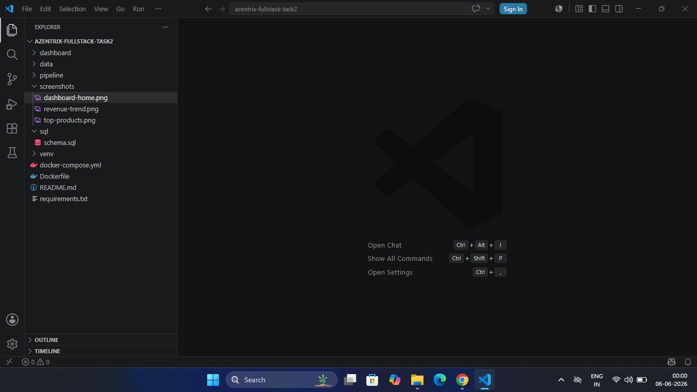
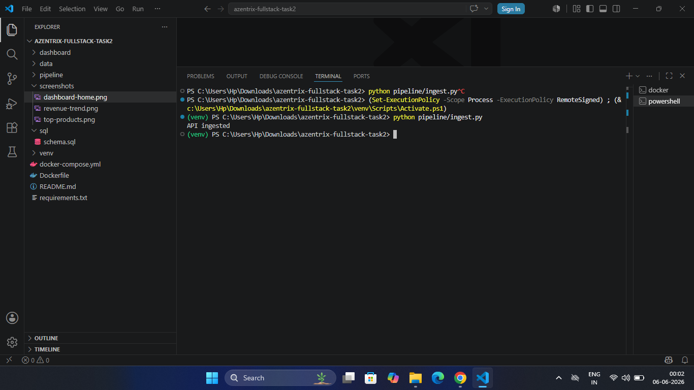
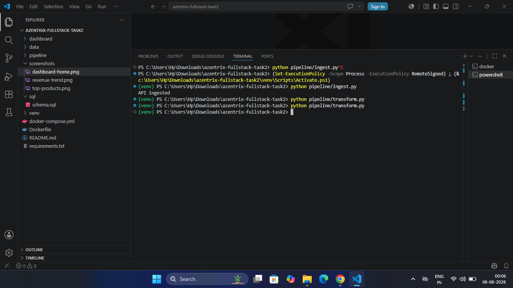
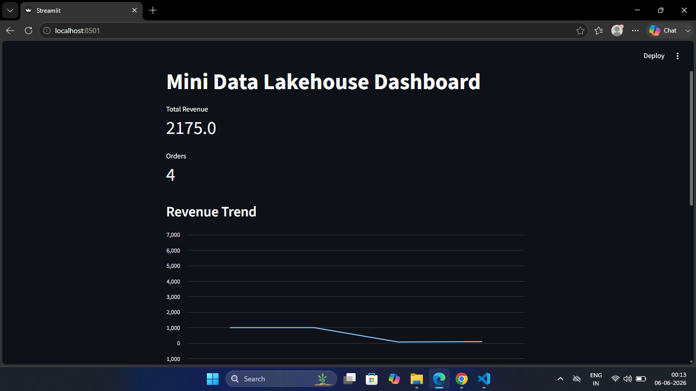
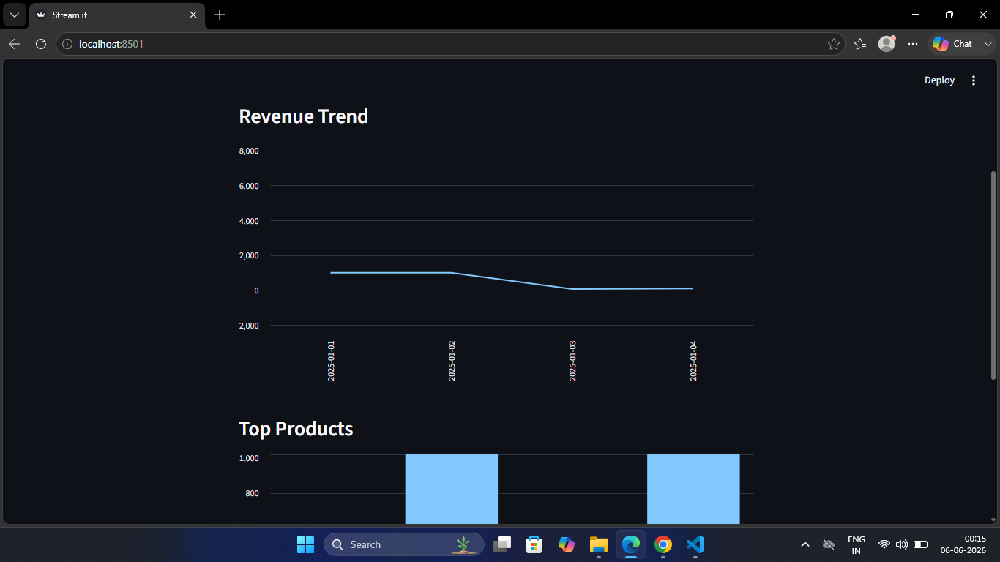
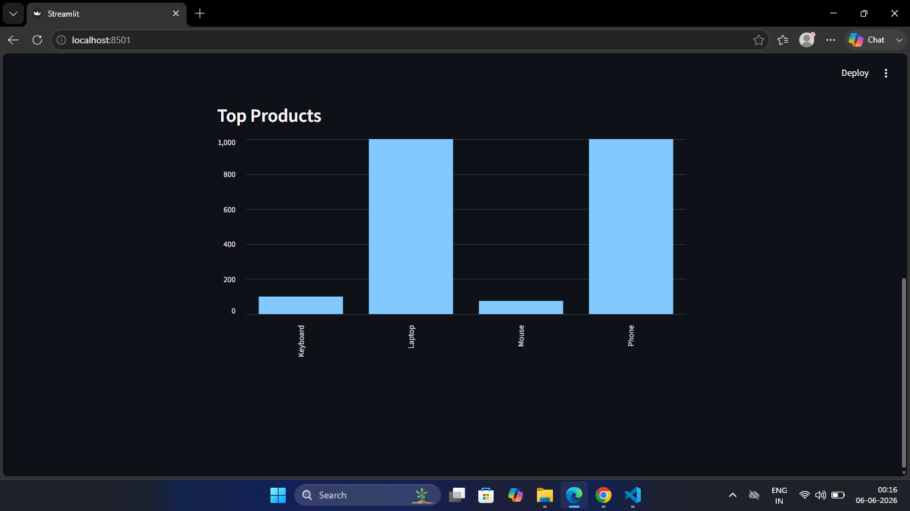

# Mini Data Lakehouse with Analytics Dashboard

A complete end-to-end Data Engineering project that demonstrates a Mini Data Lakehouse architecture using Python, PostgreSQL, Streamlit, and Docker. The pipeline extracts data from multiple sources, transforms and cleans it, loads analytics-ready data into PostgreSQL, and visualizes business insights through an interactive dashboard.

---

## Project Overview

This project implements an ETL (Extract, Transform, Load) pipeline that:

* Extracts data from CSV files and REST APIs
* Cleans and transforms raw datasets
* Creates curated analytics datasets
* Loads processed data into PostgreSQL
* Visualizes insights using Streamlit
* Supports Docker-based deployment

---

## Features

* CSV Data Ingestion
* REST API Data Ingestion
* Data Cleaning & Transformation
* Curated Analytics Dataset Generation
* PostgreSQL Integration
* Interactive Streamlit Dashboard
* Dockerized Deployment
* Modular ETL Architecture

---

## Technology Stack

### Programming Language

* Python

### Data Processing

* Pandas
* Requests
* PyArrow

### Database

* PostgreSQL
* SQLAlchemy

### Visualization

* Streamlit
* Plotly

### Containerization

* Docker
* Docker Compose

---

## Project Structure

```text
azentrix-fullstack-task2/
│
├── dashboard/
│   └── app.py
│
├── pipeline/
│   ├── ingest.py
│   ├── transform.py
│   ├── load.py
│   └── run_pipeline.py
│
├── sql/
│   └── schema.sql
│
├── data/
│
├── screenshots/
│   ├── project-structure.png
│   ├── etl-ingestion.png
│   ├── etl-transformation.png
│   ├── dashboard-home.png
│   ├── revenue-trend.png
│   └── top-products.png
│
├── .gitignore
├── .gitattributes
├── Dockerfile
├── docker-compose.yml
├── requirements.txt
└── README.md
```

---

## ETL Workflow

### Extract

* Read source data from CSV files
* Fetch data from REST APIs

### Transform

* Clean invalid records
* Handle missing values
* Standardize formats
* Generate analytics-ready datasets

### Load

* Load transformed data into PostgreSQL

### Visualize

* Display business insights using Streamlit

---

## Running the Project

### Run ETL Pipeline

```bash
python pipeline/ingest.py
python pipeline/transform.py
python pipeline/load.py
```

### Run Dashboard

```bash
streamlit run dashboard/app.py
```

Dashboard URL:

```text
http://localhost:8501
```

---

## Screenshots

### Project Structure



### ETL Ingestion



### Data Transformation



### Dashboard Home



### Revenue Trend Analysis



### Top Products Analysis



---

## Submission Links

### GitHub Repository
**Repository Name:** azentrix-fullstack-task2
## GitHub Repository URL

https://github.com/shubham101-web/azentrix-fullstack-task2

### Loom Demonstration Video
https://www.loom.com/share/c6ca99728f754d97be7b53e84e2bb8e8
---

## Deliverables Completed

* ETL Pipeline
* Data Transformation
* PostgreSQL Integration
* Streamlit Dashboard
* Docker Support
* Project Documentation
* Screenshots Included
* GitHub Repository
* Loom Demonstration Video

---

## Author

**Shubham**

Azentrix Full Stack Task 2
